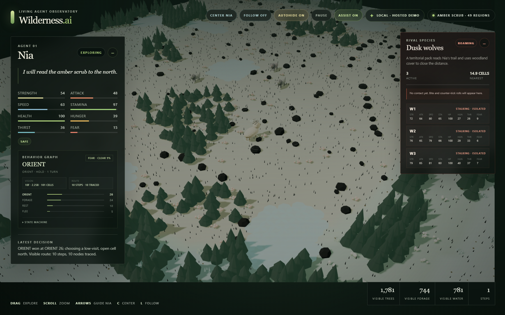

# Wilderness.ai

[**Open the live simulation →**](https://monstercameron.github.io/wilderness.ai/)



Wilderness.ai is an observable autonomous-creature simulation. An elk named
Nia perceives a limited local area, maintains needs and spatial memory, chooses
an action, and moves through a deterministic procedural ecosystem.

The GitHub Pages build runs entirely in the browser with the deterministic local
planner. Cerebras Gemma inference is available when running the localhost server,
which keeps the API key in process memory instead of exposing it in browser code.

The code is separated into four layers:

- **Simulation** — streamed terrain regions, trees, forage, water, time, and vitality.
- **Perception and cognition** — local sensing, memory, path scoring, and decisions.
- **Presentation** — an instanced Three.js wilderness, animated agent model, camera,
  lighting, fog, and responsive HUD.
- **Orchestration** — the main loop synchronizes agent decisions, simulation ticks,
  rendering, input, and UI updates.

The simulation can use Cerebras Gemma 4 31B for structured movement decisions.
Enter a Cerebras API key through the in-app modal, or continue with the local
deterministic policy. The key is sent only to the localhost server, held in
process memory, never logged or persisted, and erased when the server stops.

Cognition runs as a strict round robin: Nia, W1, W2, then W3. Every animal gets
one structured decision containing both an adjacent target grid cell and an
action. Local survival and hunting instincts provide a recommendation to Gemma,
validate its response, and safely take over when Assist is enabled and a response
is blocked, unsafe, or unavailable.

Every animal has eight simulation-driving vitals: strength, attack, speed,
stamina, health, hunger, thirst, and fear. Movement and attacks spend stamina, rest restores it,
deprivation erodes health and effective strength, fear corrupts Nia's perception
and route scoring, and thirsty wolves can interrupt a hunt to seek water. Derived condition
tags such as safe, hunted, cornered, exhausted, starving, wounded, pursuing, and
isolated expose the instincts currently influencing a decision.

Elk and dusk wolves use deliberately different procedural silhouettes. A
seeded morphology profile adds small stable offsets to body length, width, height,
leg length, head size, ears, coat tone, horns, and tails, so each individual is
recognizable without changing shape whenever a region reloads.

Peak wolf speed is about 25% above Nia's, making Nia roughly 20% slower, while
her stamina pool is about 50% larger. Per-animal movement budgets turn speed into
actual grid cadence. Sprinting wolves consume stamina faster and temporarily give
up a pursuit when an elk with enough open space outlasts them.

Close contact resolves as transparent combat rolls. A wolf bite uses its current
attack, strength, stamina, and Nia's speed to determine hit chance and damage.
Nia then attempts a reflexive scramble kick with a fixed 20% hit chance; a hit
damages the attacking wolf, and either animal can become wounded, critical, or
down. The latest rolls and resulting health loss appear in the rival panel.

`elk-mind.js` contains Nia's weighted utility state machine. Its explicit graph
moves among orient, forage, seek water, rest, flee, breakout, and recover states.
Competing scores combine needs, actual and fear-distorted threat distance, escape
routes, resources, injury, and recent state, with hysteresis to reduce indecisive
state thrashing. A cornered elk can enter BREAKOUT and deliberately spend health
and stamina for one immediate escape step. The live state, transition, fear
corruption, and strongest utility scores are inspectable in Nia's panel.

`agent.js` turns the winning state into a local move. `inference.js` sends the
same graph, priorities, fear corruption, and accepted tradeoff to Gemma, then
validates its structured intent and action. `server.js` keeps credentials out of
client code and calls the Cerebras chat-completions API.

Nia's perception is directional rather than circular. `navigation.js` models an
offset oval aligned to her facing: roughly ten cells forward, five cells to
either side, and only 2.25 cells behind. A grid DDA raycast stops sight at the
first intervening tree and prevents diagonal corner-peeking while leaving the
blocking tree itself visible. A
bounded A* tracer searches only this currently visible space, avoids blocked
diagonal corners, prices difficult terrain and nearby predators, and supplies a
short route to resources or escape ground. The oval and active route are drawn
lightly on the terrain, while the HUD reports visible cells and traced nodes.

The wilderness is spatially deterministic and effectively unbounded. Sixteen-cell
regions are generated around both the camera and Nia, while distant geometry is
recycled. Revisiting the same coordinates reconstructs the same habitat, including
remembering forage that Nia already consumed.

Climate and elevation blend five biomes: open meadow, deep woodland, silver
wetland, stone highland, and amber scrub. Each biome changes ground color,
vegetation density, tree coloration, forage likelihood, and rock cover. Resource
patches are biome-specific: meadow clover, woodland mushrooms, wetland watergrass,
highland lichen, and scrub berries. Ponds and decorative flowers make useful
habitat features visually legible instead of leaving the terrain sparse.

A three-member dusk-wolf pack is the rival species. Wolves track across the
streamed world, prefer cover, pursue at close range, and can injure Nia. Predator
positions are included in both the local heuristic perception and the structured
Gemma snapshot, so threat avoidance can outrank resource gathering.

## Run locally with optional Gemma inference

```powershell
npm install
npm start
```

Open <http://127.0.0.1:8080>.

The app starts with the local planner. Open the model control and enter a
Cerebras API key to let Gemma 4 31B participate in round-robin decisions. The
key remains only in the local Node process and is cleared when the server stops.

## GitHub Pages

Every push to `main` verifies the simulation, builds a static browser bundle,
and deploys it to <https://monstercameron.github.io/wilderness.ai/>. The hosted
version intentionally disables API-key entry because GitHub Pages cannot keep a
secret or run the localhost inference bridge.

## Controls

- Drag to pan.
- Scroll to zoom.
- Arrow keys move Nia in cardinal directions.
- Home, Page Up, End, and Page Down move diagonally.
- **Pause** stops autonomous decisions without disabling manual guidance.
- **Assist On/Off** controls whether local heuristics may recover failed, blocked,
  or repeatedly looping model decisions.
- **Center Nia** (or `C`) recenters the camera without changing its mode.
- **Follow Off/Follow Nia** (or `L`) locks and unlocks continuous camera tracking.
  Zoom remains available while following; panning resumes when follow mode is off.
- The minus/plus buttons independently collapse and expand Nia's and the wolves'
  status panels.
- **Autohide On/Off** controls whether the HUD fades after five seconds without
  pointer movement. Moving the pointer restores it immediately.

## Verify

```powershell
npm run check
npm audit
```
